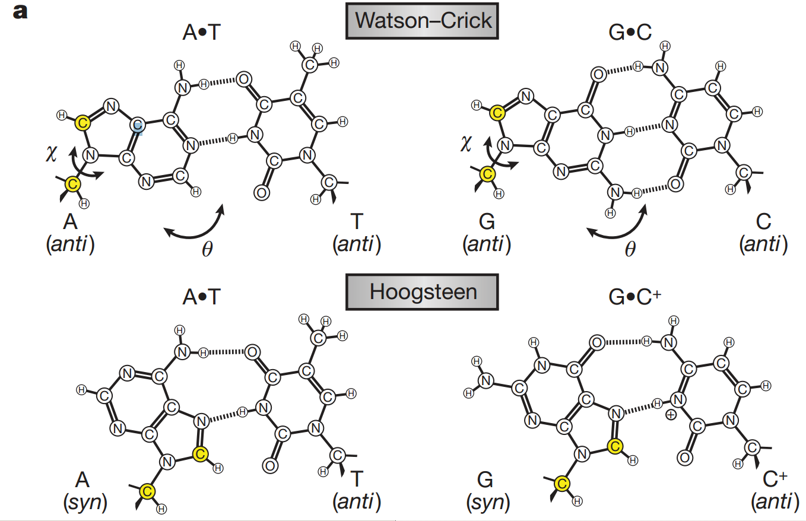

Hoogsteen base pairing involves A-T or G-C base pairing via hydrogen bonds.
They occur rarely.

The basic chemistry is different. The non Watson-crick nature allows
formation of DNA triplexes which can be more stable than the DNA-DNA duplexes

