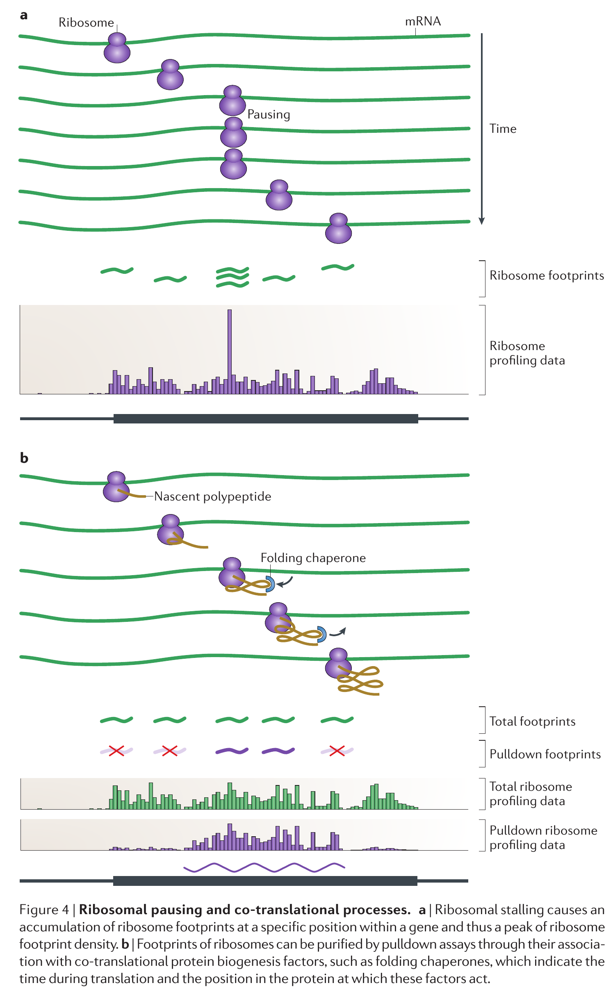

---
author:
- Saket Choudhary
bibliography:
- 'Zotero.bib'
title: |
    \[Review\] Ribosome profiling: new views of translation, from single
    codons to genome scale\
    Nicholas T. Ingolia\
    My notes 
---

**Motivation**

-   Transcript abundance is often a good proxy for measuring protein
    abundance, but the correlation protein mRNa and protein is poor

-   Ribosome profiling experiments make this a bit better by profiling
    only mRNAs ound by ribosome, but they still do not indicate which
    protion of the transcript is getting translated

Ribosome profiling broad use cases:

-   Identify translated sequences in the transcriptome

-   Monitor translation and maturation of poplypetides in vivo

-   Measure profiles of cellular protein synthesis

Polysome: Several transalting ribosomes that are held together by a
single transcript

Polysome profiling: Separation between translated and non-translated
mRNAs is qualitative, but can be made more quantitative by using
ulracentrifugation to separate transripts into several fractions on the
basis of number of ribosomes bound to each mRNA.

-   Hindrance in polysome profiling comes at the fractation step which
    will not cleanly resolve transcripts bound by mutiple ribosomes

-   Polysomal profiling do not calculate the exact location of bound
    ribosomes, only indicate typical number of ribosomes bound anywhere
    on the transcript

Ribomsome profiling overcomes the short comings of polysomal profiling:

-   Cycloheximide treated ribosomes physically encode 28-30 nucleotides
    of the transcript shielinding them from nuclease digestion

-   Ribo-Seq essentially utilises high throghput sequencing to sequence
    the footprints

-   In ribo-seq each fragment reflects the position of one ribosome,
    rather than the arbitrary fragments that constitute template
    molecules in RNA-seq

-   Ribo-Seq measures the number of ribosomes that are translating the
    mRNA in-vivo, instead of the abundance of the transcript

-   Since ribo-seq and rna-seq are so similar, the same set of
    bioinformatic tools can be used to profile

Ribo-Seq data interpretation:

-   Footprints are mostly part of CDS and are almost entirely absent
    from the 3’UTR.

-   Average ribosome density on mRNA species provides an estimate of the
    synthesis of level of proteins provided the speed of transaltion is
    similar across genes and conditions being investigated

-   Each transation event results in production of one protein molecule,
    but the time required to syntheisze that molecule is roughly
    proportional to the lngth of CDS

-   Longer CDS will have more ribosomes than shorter CDS that produce
    the same amount of protein, but the density will be the same(same
    number of ribosomes per unit length)

-   Ribo-seq can alone account for the protein abundance difference
    arising from difference in mRNa abundance or translation

-   Ribosomes tend to spend different amounts of time at different
    positions within a reading frame: this leads to variation in density
    across a transcript

-   Elongation speed may confound expression measurement by uncoupling
    ribosome density from initiation rate: gene wide considerations tend
    to overcome such local variations

-   studies suggest it is the rate of initiation rather than the rate of
    elongation,that is the major determinant of protien production

-   Changes in elongation speed across conditions can be detected by
    profilingas they will be manifested as shifts in ribosome profile

Limitations of Ribo-Seq:

-   Shorter reads: difficult to map

-   Paired end or longer reads no possible due to the shorter size of
    the protected fragment

-   5’UTR and 3’UTR regions are degraded which may otherwise contain
    regulatory information

-   Since the resolution is at one ribosome level, it is impossible to
    find out mRNA subpopulations that are translated at different levels
    and are occupied by different numbers of ribosome,

Translation intiation and reading frames

-   Ribo-Seq studies have revelaed that ribosome occupancy on the
    5’leaders of the transcripts cannot be explained by initiation that
    always takes place at the first AUG codon or even by initiation that
    beings at AUG codon alone

-   Pattern of ribosome occupancy often implies the exact sites of
    translatioon initiation , but multiple overlappign reading frames
    and subtantial initiation at non-AUG (start) codons complicate the
    analysis

-   Harringtonine, Lacitimidomycin immobilize initiating ribosome
    without affecting elongation

-   Puromycin causes premature transaltion termination thus leaving
    footprints of and after sites of initiation

-   Initiation is seen to be highly biased towards 5’ ends of
    transcripts and results in translation of known reading frame of
    protein cooding gens, extended or shortened versions of the CDSs and
    short upstream open reading frames.

Alternative protein isoforms:

-   If there ae two transaltion initiation sites in the ORF, they will
    yield an extended and one truncated isoform of the same protein

Novel translated sequences:

-   Transaltion heterogenity discovered by Ribo-seq seems to be in
    entirely ditinct, previously unrecognised reading frames

-   These reading frames lie in the 5’ transcript leader region, in
    alternative reading frames overlapping genes and in lincRNAs

-   These ribosome bound sequences are biased towrds 5’ and associated
    with AUG codons hence hinting at translational importance

-   Proteins are also known to be transated from thee sites out of CDS,
    but the functional role of these proteins is not known

-   Some lincRNAs seem to be translated to some extenet despite the
    evidence that ehy do not code for proteins. However this could
    simply reflect the basal translation level that occurs at the 5’ end
    of cytosolic RNAs.

-   The transalton arising from the lincRNAs is often referred to as
    lincRNAs uORFs.

Regulatory upstream translation:

-   uORFS can capture scanning ribosomes decreasing the translaton
    levels of downstream protein coding gens

-   Ribo-Seq studies have found correlation between upstream translation
    and lower level of downstream translation

-   uORF translation also correlates with lower mRNA stabilit

Protein synthesis in-vivo

-   subpopulations of ribosome can be purified on the basis of binding
    of specific accessory facotrs and profiled: fotprints from such
    ribosomes provide information about a specific time in transaltion
    including the identity of mRNAs being translated

Speed of translation affected by: transcript structure, tRNA abundance
and protein sequence.

-   The relative density of footprints in the same coding sequence is a
    reflective of the amount of time the ribosome spends at each codon,
    slow transaltion will reflect increased density at a point

-   Decoding speed has been found to vary by two fold across codons and
    does not correlate with genomic codon preference

-   In yeast, the slow decoding time could be resulting from slow tRNA
    recycling,

-   In c.elegans and humans decoding time is not affected by tRNA levels
    but instead slowed by wobble pairing(g-U pairing) in codon-anticodon
    region3

-   The ’ramp’ at the beginning of genes, hinting at slow translation in
    the beginning can be explained by the higher rate of transaltion of
    short genes hich contribute disproportionately to the average

-   Positive charged amino acids can slow ribosomes
