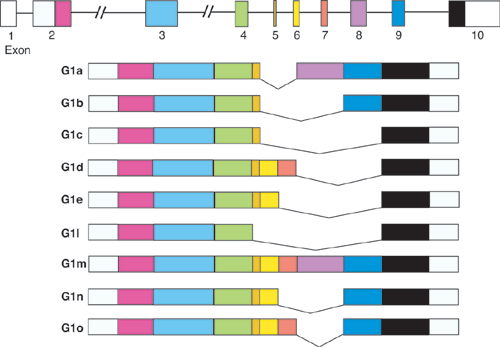
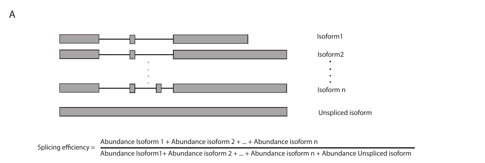
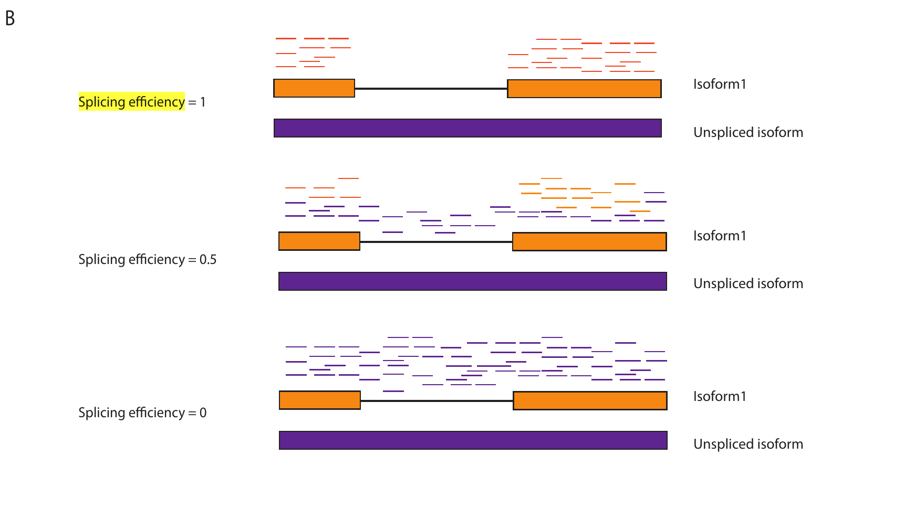
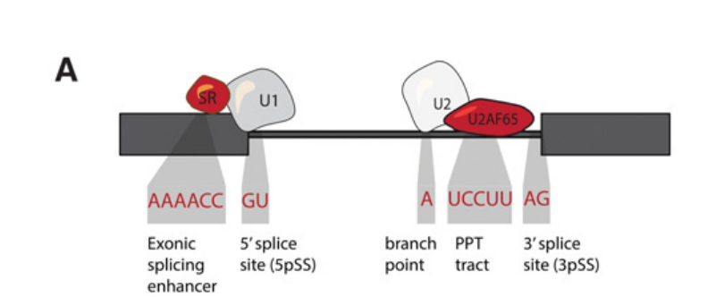

lincRNAs share a lot of their biogenesis with mRNAs: lincRNAs are transcribed by RNA Poll II, 5’ capped, spliced, and polydenaylated.

lincRNAs differ from RNAs: Fewer (but longer) exons. have more nuclear localization . They wanted to understand if these differences are observations arising from different processing and whether these differences have functional implications. It has been argued that lncRNAs are probably function-less owing to the limited evolutionary conservation, but there have been other reports of them being evolutionary conserved, including TFBS binding sites, nuclear localizing signals and splicing motifs.

The focus here is on intergenic lncRNAs : lincRNAs

Part 1
------

Check if promoters of lincRNAs (active promtoers) differed in chromatin context from set of expression matched mRNA. Promoter regions are defined as +-5kb from the TSS.

Results: Promoters of lincRNAs were depeleted in all histone marks as compared to mRNA. The only histone mark encirched was H3K9Me3 which is associated with repression.

lincRNAs are enriched for TFBS
------------------------------

Does not matter how promoters of lincRNAs are defined +-3kb or +-10kb they are enriched in TFBS. It is also agnostic to whether the sites were found from a CHIP-seq study or a database search of motifs.

Splicing
--------

The most discriminating feature appears to be splicing. Splicing efficiency is defined as the ratio of the sume of abundance of different isoforms to the sum of isoforms with the unspliced isoform.

Exon splicing enhacers refers to sequence motifs located within exons that regulated splicing. These were found to be overrepresented in lincRNAs.

### U1-PAS

U1 is a small nuclear ribonucleo prortein that binds at the 5’ SS and recruits spliceosome machinery,.

### lincRNA vs mRNA Decay

lincRNAs have been observed to be less stable than mRNAs. Stability was determined by antinomycin D treatment.

In terms of HuR, they found that the degree of binding was similar but in terms of localization, it was shifted to 3’UTR for mRNA.
