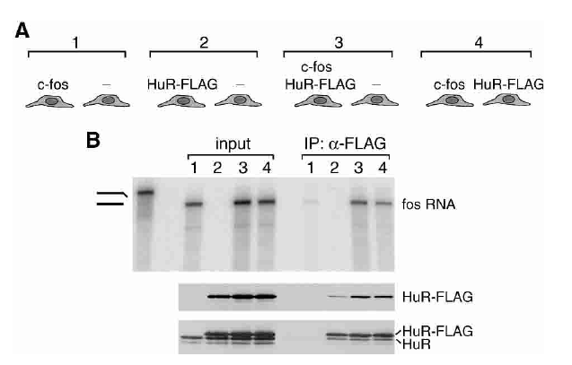

This is really an interesting article. Immunopreiptation based methods such as HITS-CLIP/iCLIP/PAR-CLIP can be used to characterise RBP complexes. Consider a scenario where the sample consists of two cell populations. The RBP expressed in cell population 1 will can associate with the mRNA in cell population 2 after cell lysis.

The exeriment is very simple and straightforward. Start with 4 inputs, one with only c-fos, second with HuR-FLAG(HuR with FLAG tag at C terminus) and third with c fos and HuR-FLAG in only one population while fourth with these two in different populations. Ideally when HuR and fos are in two different population, there should not be any binding unless the assoication happens post lysis, which actually does happen. So even though th target of HuR are in different cell population,
